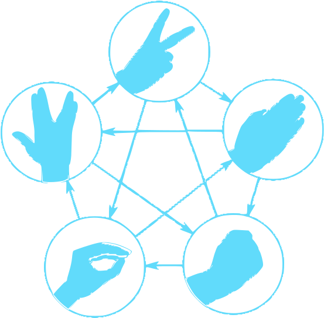
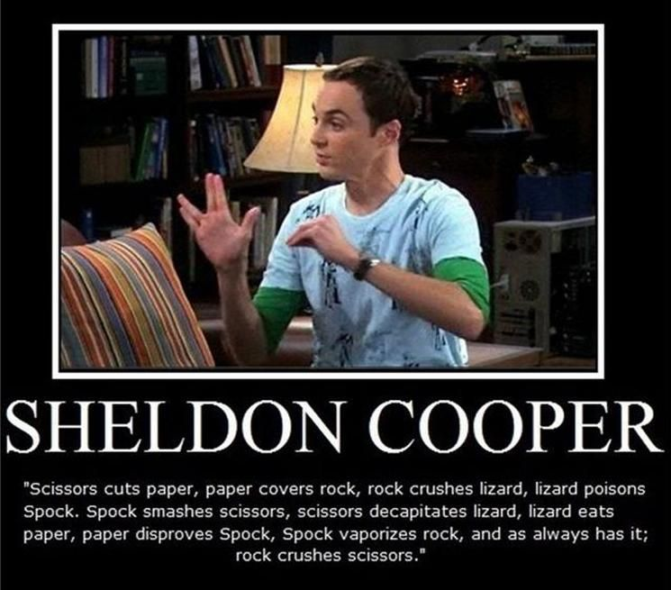

<h1 align="center">

 
Rock Paper Scissors Lizard Spock
</h1>

It's simple. Scissors cuts paper, paper covers rock, rock crushes lizard, lizard poisons Spock, Spock smashes scissors, scissors decapitates lizard, lizard eats paper, paper disproves Spock, Spock vaporizes rock, and as it always has, rock crushes scissors.

  
  &nbsp;
  

  <a href="https://faisalakhtar.github.io/rock-paper-scissor-lizard-spock/">Play Game</a>
  ·
  <a href="https://github.com/faisalAkhtar/rock-paper-scissor-lizard-spock/issues/new/choose">Report Bug</a>
  ·
  <a href="https://github.com/faisalAkhtar/rock-paper-scissor-lizard-spock/issues/new/choose">Request Feature</a>

<h2 align="center">Built with :heart: and :sparkles:ReactJS:sparkles:</h2>

  It's simple!
   
  
   
  <a href="https://youtu.be/pIpmITBocfM">Video link</a>

